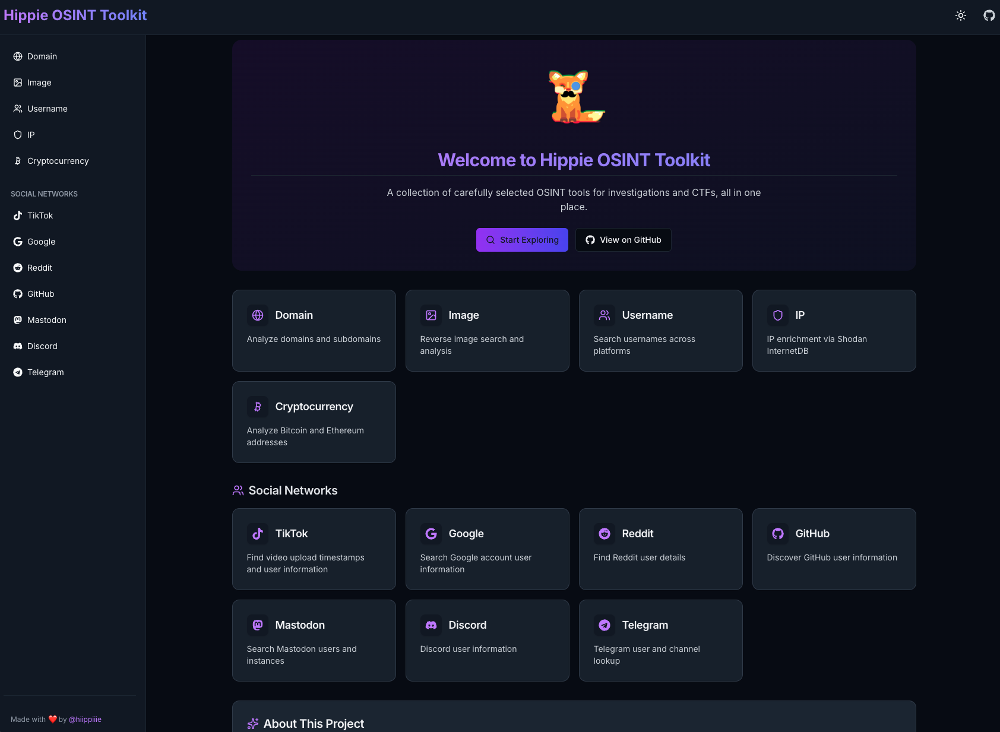

# Hippie OSINT Toolkit (HOT)
<p align="center">
  An OSINT toolkit providing informations on techniques and simple tools packaged in a nice responsive UI.
  <br>
  <a href="https://twitter.com/intent/follow?screen_name=hiippiiie" title="Follow"></a>
  <br>
</p>

I created this project to gather in the same place knowledge I learnt in OSINT, to share it and gives access to everyone. This project is a mix between short articles and tools that I use/like. Everything is integrated in a web UI and with tools running on the backend, you can host it on your server and use it from anywhere.



## Features

Different tools are available in the UI giving you access to these features:
- Domains:
  - WHOIS
  - crt.sh domain enumeration
- Social networks:
  - Tiktok video timestamp extractor
  - Google account search ([ghunt](https://github.com/mxrch/GHunt))
  - Reddit account search (reddit API)
  - Github account search ([osgint](https://github.com/hippiiee/osgint))
  - Mastodon account and instance search ([masto](https://github.com/C3n7ral051nt4g3ncy/Masto))
  - Discord user search
- Images:
  - Google reverse image search
  - Yandex reverse image search
- Username search ([whatsmyname](https://github.com/WebBreacher/WhatsMyName) and [socid-extractor](https://github.com/soxoj/socid-extractor))

## Installation

Create a `.env` file to provide your optional GHunt token and Reddit API credentials without storing them in the image:

```dotenv
GHUNT_CREDS_DATA=your_base64_credentials
REDDIT_CLIENT_ID=your_client_id
REDDIT_CLIENT_SECRET=your_client_secret
```

Optionally, modify the `NEXT_PUBLIC_BACKEND_API` build argument in `docker-compose.yml` to run the backend on a remote server.

```bash
docker compose up
```

And that's it, you can now access the app on `http://localhost:3000`.

## Contributing

Feel free to contribute to the project, if you want to had techniques, write articles or even integrate new tools.

### Backend runtime and regression tests

The backend uses Flask-SocketIO's native threading mode with one Gunicorn
`gthread` worker and 100 HTTP threads. Each asynchronous search runs its own
`asyncio.run()` in a background thread; do not enable Eventlet monkey-patching
or select an Eventlet worker. This follows the
[Flask-SocketIO threaded deployment configuration](https://flask-socketio.readthedocs.io/en/latest/deployment.html#gunicorn-web-server).

Run the offline concurrency, cancellation, decoding, and real WebSocket tests:

```sh
docker compose run --rm --no-deps --entrypoint python backend -m unittest discover -s tests -v
```

GHunt is installed in its own pipx environment from upstream commit
`5ee893929c51c7a8a665b199bbae04ce85a662b4` rather than PyPI 2.3.4. This includes
[upstream PR #592](https://github.com/mxrch/GHunt/pull/592), which fixes missing
cover-photo `container` metadata, missing profile-edit timestamps, and undefined
variables in JSON export. A backend image rebuild is required to apply this pin.

The Google module supports `GHUNT_EXECUTABLE` for a custom local executable,
limits a lookup to 180 seconds, and removes its temporary files on every exit.
Errors shown to clients are classified messages; raw GHunt diagnostics and
credentials are not logged or returned. Keep session files outside the repository.

Verify the installed GHunt parser/export fixes separately in its isolated Python:

```sh
docker compose run --rm --no-deps --entrypoint /root/.local/share/pipx/venvs/ghunt/bin/python backend -m unittest discover -s tests -p ghunt_dependency_checks.py -v
```
