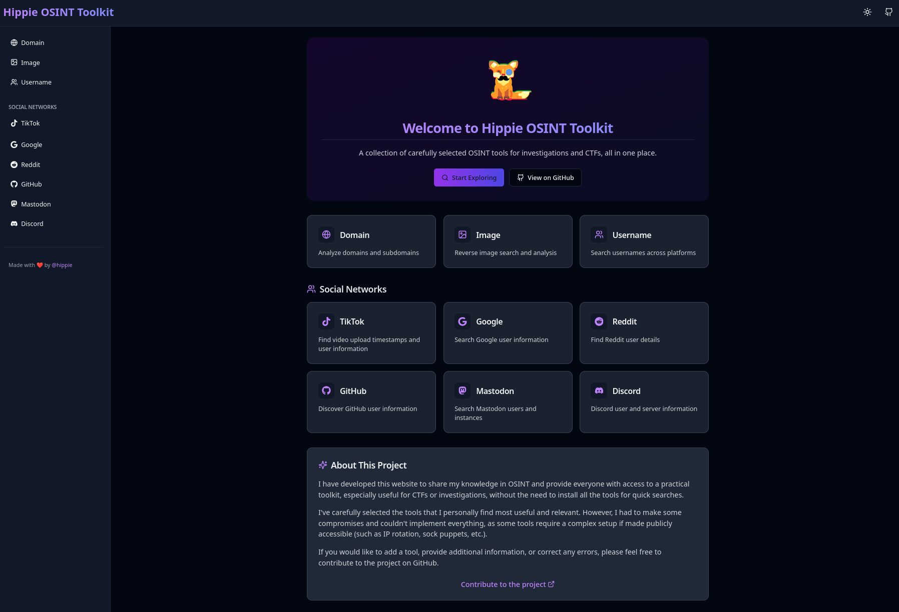

# Hippie OSINT Toolkit (HOT)
<p align="center">
  An OSINT toolkit providing informations on techniques and simple tools packaged in a nice responsive UI.
  <br>
  <a href="https://twitter.com/intent/follow?screen_name=hiippiiie" title="Follow"></a>
  <br>
</p>

I created this project to gather in the same place knowledge I learnt in OSINT, to share it and gives access to everyone. This project is a mix between short articles and tools that I use/like. Everything is integrated in a web UI and with tools running on the backend, you can host it on your server and use it from anywhere.



## Features

Different tools are available in the UI giving you access to these features:
- Domains:
  - WHOIS
  - crt.sh domain enumeration
- Social networks:
  - Tiktok video timestamp extractor
  - Google account search ([ghunt](https://github.com/mxrch/GHunt))
  - Reddit account search (reddit API)
  - Github account search ([osgint](https://github.com/hippiiee/osgint))
  - Mastodon account and instance search ([masto](https://github.com/C3n7ral051nt4g3ncy/Masto))
- Images:
  - Google reverse image search
  - Yandex reverse image search
- Username search ([whatsmyname](https://github.com/WebBreacher/WhatsMyName) and [socid-extractor](https://github.com/soxoj/socid-extractor))

## Installation

Modify the `docker-compose.yml` file to add your GHunt base64 token (if you want to use it), and reddit dev app client and secret to make request on the reddit API.
optionally, you can modify the `NEXT_PUBLIC_BACKEND_API` variable to run the backend on a remote server.

```bash
docker compose up
```


And that's it, you can now access the app on `http://localhost:3000`.

## Contributing

Feel free to contribute to the project, if you want to had techniques, write articles or even integrate new tools.
